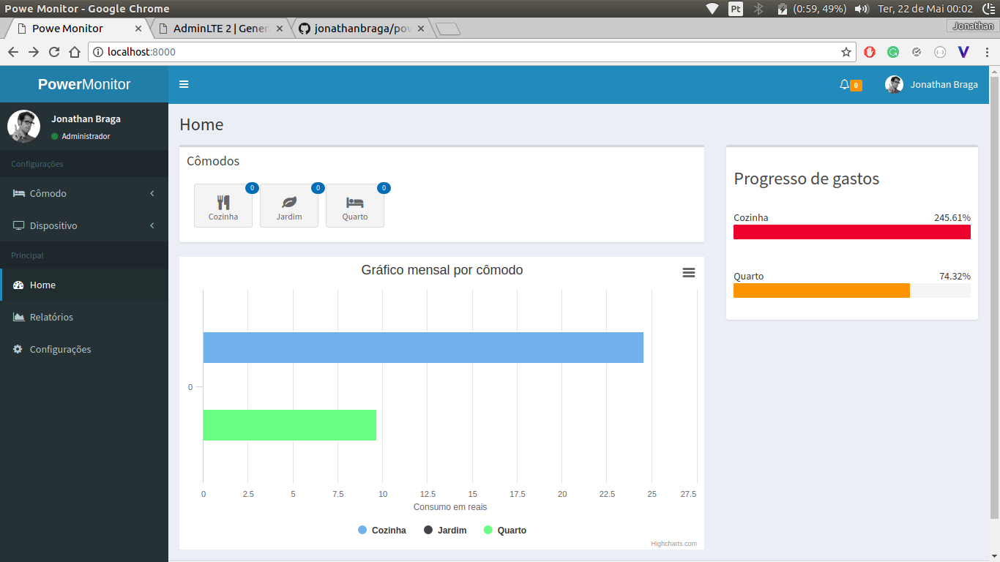
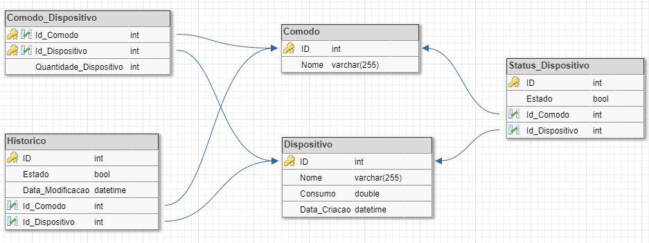

# Power-monitor
A low-cost solution to monitor power

## Database scheme

### Para rodar o projeto

Caso não tenha o bower instalado 

`sudo apt-get install nodejs-legacy`

Passo 1:

`bower install` 

`npm install`

Passo 2:

`nodejs server.js`

### MYSQL

`mysql -u root -p`
