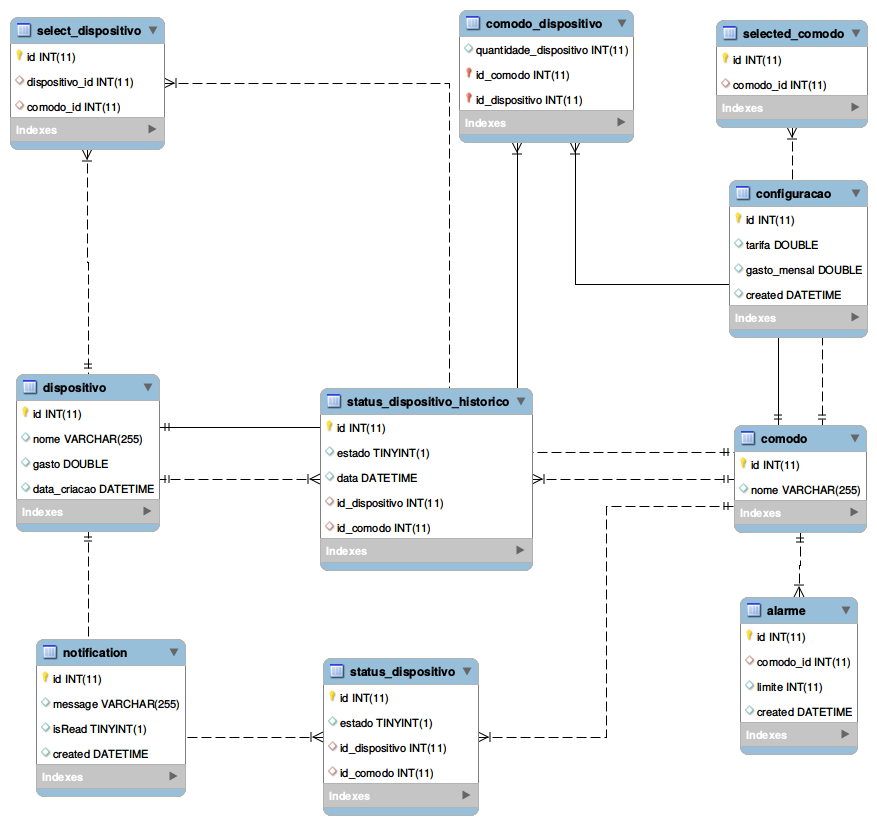

# Power-monitor
O power monitor é uma solução simples e eficiente para o monitoramento de energia elétrica. Focado em facilidade a plataforma foi desenvolvida pensando em uma fácil comunicação com qualquer hardware. Usando comunicação `websocket` a plataforma disponibiliza alguns end-point para a obtenção e cadastro dos dados.

## Database scheme

### Instalação
 Antes de tudo é preciso instalar o `nodejs` e o `mysql`,  basta seguir os passos abaixo:

#### Nodejs
    - Passo 1: 

`$ sudo apt-get update`

`$ sudo apt-get install nodejs`

    - Passo 2:

`$ sudo apt-get install npm`

#### MySQL

    - Passo 1:

`$ sudo apt-get install mysql-server`

    - Passo 2:

`Defina a sua senha`

    - Passo 3:

Após a instalação concluir insira no terminal:

`mysql -u [usuário] -p`

#### Rodando o projeto

Caso não tenha o bower instalado 

`sudo apt-get install nodejs-legacy`

- Após todos os passos da instação basta clonar o repositório e seguir as últimas instruções

Baixando todas as bibliotecas do bower

`bower install` 

Baixando todas as bibliotecas do npm

`npm install`

Para finalizar, vamos criar as tabelas no banco de dados:

Insira os comandos no terminal:

`mysql -u [usuário] -p`

`CREATE DATABASE db;`

`use db;`

Por fim, vá no arquivo `tables.sql` copie tudo e cole no terminal.

Pronto! agora basta rodar a nossa aplicação

`nodejs server.js`

* Todos os gráficos são feitos usando a biblioteca highcharts, em caso de dúvida veja o arquivo `LICENSE.txt`.

